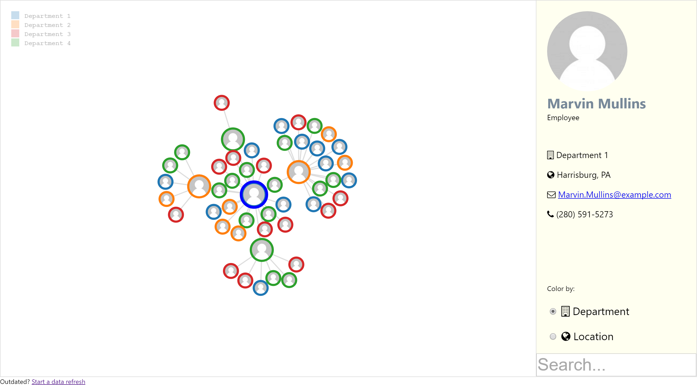

**Azure Active Directory Organization Chart Viewer**



## In A Galaxy Far Far Away...

It is a dark time for the Galaxy. Active Directory holds crucial troop information but is seemingly impenetrable even to those with access to the force.

A group of developers led by @kendaleiv has established a new project based on D3.js, Node.js, and other tools on the remote ice world of GitHub designed to infiltrate and free the data.

Obsessed with finding more information, the developers have dispatched remote probes into the far reaches of space...

## Usage

- Install [Node.js](https://nodejs.org) and npm *(if they are not already installed)*.
- Configure Azure Active Directory:
  - Enable client credentials authentication
  - Allow necessary directory access
- Clone this repository, or download and extract it.
- Next, in the repository root folder create a `.env` text file matching the following:

```
ENDPOINT_ID=the_endpoint_id_value
CLIENT_ID=the_client_id_value
CLIENT_SECRET=the_client_secret_value
```

Optionally, specify the `IMAGE_RETRIEVER` in `.env` as well *(defaults to `GravatarImageRetriever`)*:

```
IMAGE_RETRIEVER=Office365GetPersonaPhotoImageRetriever
```

- Install, build, and start:

```sh
> npm install
> npm run build
> npm start
```

## Organization size note

A reasonable upper limit of users at this time is approximately 150. Currently the graph does not scale well to higher numbers and provides no sizing or zooming mechanisms to fit additional data. Enhancements and/or changes may be necessary for this project to work *well* with larger data sets, which may even include disabling animation for the graph.

Supporting a large graph is currently outside the scope of this project, but if your needs dictate displaying a larger data set perhaps we can work something out -- let's talk in an issue before you invest in creating a PR!

## Development notes

The application consists of two components, a *client* and a *server*.

For local development `npm run start:watch` can be useful. This will watch both `src/client` and `src/server` directories and react as necessary. For `src/server` changes the server will be restarted -- which includes retrieving data as part of server startup.

## Attribution

- Logos adapted from "[Death Star](https://thenounproject.com/term/death-star/191002/)" by [Sergey Demushkin](https://thenounproject.com/mockturtle/) licensed under [CC BY 3.0 US](https://creativecommons.org/licenses/by/3.0/us/).
- Font Awesome by Dave Gandy - http://fontawesome.io

## Author

Ritter Insurance Marketing http://rimdev.io

## License

- **MIT** : http://opensource.org/licenses/MIT

## Contributing

Contributions are highly welcome!
